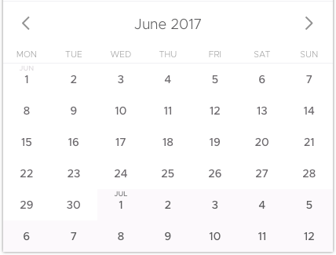

Тестовое задание
==================================

Привет!
Цель этого задания – разработать простой виджет, представляющий из себя календарь.

Для этого тебе необходимо ориентируясь на мокап, но не слепо следуя ему, реализовать:
1. Отображение дат в виде сетки;
2. Сетка статична - выбор дат и прочий интерактив делать не надо;
3. Переход по стрелкам влево и вправо для смены месяца;
4. Вывод дней недели над колонками (язык не имеет значения);

Общие требования
----------------

* можно использовать любые необходимые тебе библиотеки
* выполнение задания должно занимать около 2-х часов (намек на то что нужно стараться решить задачу проще)

На что мы будем смотреть при оценке задания
-------------------------------------------

* Подход к решению задачи
* Верстка и стили
* Идентичность (хотя бы теоретическая) в различных средах
* Общий размер и стиль написания кода
